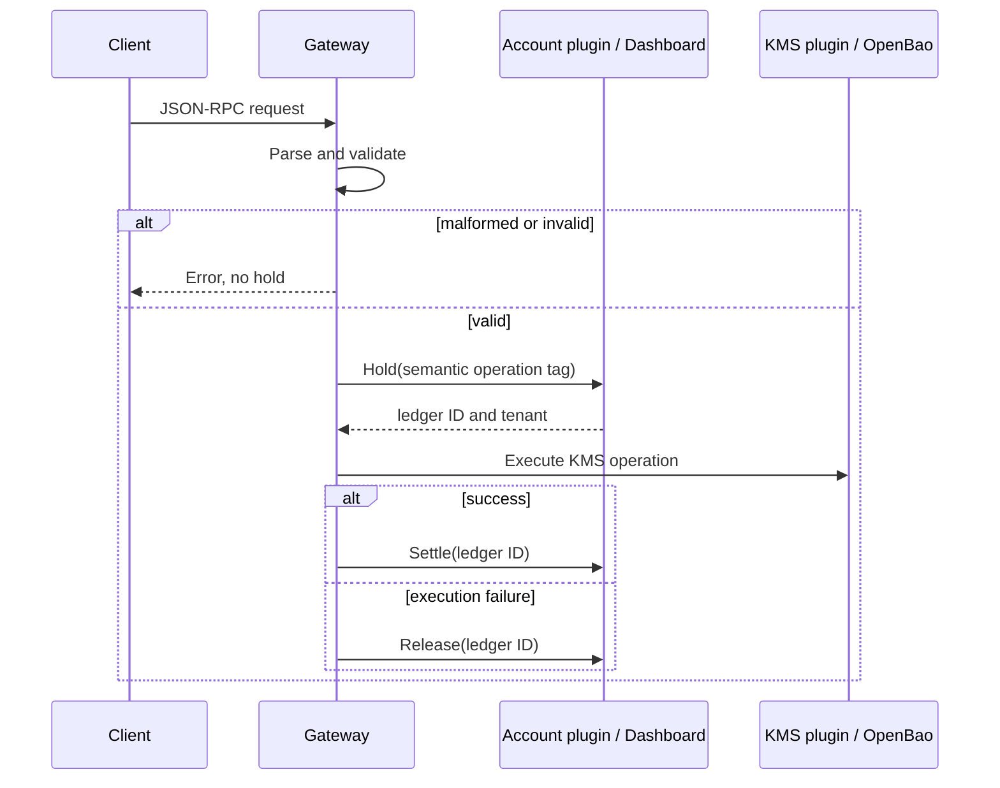

# Orbitport — Contributor context

Orbitport is SpaceComputer's multi-tenant KMS gateway. A Rust HTTP/JSON-RPC
gateway authenticates requests, applies rate limits and credit holds, then
dispatches to Go gRPC plugins backed by OpenBao.

## Architecture

```
HTTP / JSON-RPC
       |
       v
   Rust gateway ----> auth plugin
       |             account plugin
       |             KMS plugin ----> OpenBao
       |
       +-----------> PAT issuer / JWKS plugins
```

The gateway listens on HTTP port `8080`, an internal PAT-issuance port `8081`,
and Prometheus metrics port `9100`. The account plugin holds credits before a
metered request, then settles a successful request or releases a failed one.

`proto/services/` holds the public KMS API contracts; `proto/plugins/` holds
the internal gRPC contracts. Rust bindings are generated at build time. Run
`make protoc` after changing a plugin proto to regenerate the checked-in Go
bindings under `plugins/proto/plugins/`.

## Repository layout

```
gateway/                    Rust HTTP and JSON-RPC server
  src/services/jrpc.rs      JSON-RPC validation and dispatch
  src/filters.rs            Authentication, rate limiting, and credit holds
  src/plugins.rs            gRPC client catalogue

plugins/                    Go gRPC plugin services
  cmd/plugin/               Plugin dispatcher binary
  pkg/plugin/kms/           OpenBao-backed KMS implementation
  pkg/plugin/auth/          Auth0 JWT validation
  pkg/plugin/account/       Dashboard credit hold / settle / release client
  pkg/plugin/patissuer/     Personal-access-token issuer
  pkg/plugin/jwks/          Public PAT JWKS server

proto/                      Protobuf source of truth
docker-compose.yaml         Production-shaped local stack
dev.docker-compose.yaml     Development stack using noop auth
```

## Configuration

All configuration uses the `ORBITPORT_` prefix. See [`.example.env`](.example.env)
for a runnable local baseline and the plugin config files for the authoritative
defaults.

| Component | Important configuration |
| --- | --- |
| Gateway | `ORBITPORT_AUTH_PLUGIN`, `ORBITPORT_KMS_PLUGIN`, `ORBITPORT_ACCOUNT_PLUGIN`, `ORBITPORT_PATISSUER_PLUGIN`, HTTP and rate-limit settings |
| KMS plugin | `ORBITPORT_KMS_OPENBAO_PROXY_URL`, Transit, Ethereum, PQC, metadata KV, and key-store KV mount paths |
| Account plugin | Dashboard URL plus Auth0 M2M client settings and `ORBITPORT_ACCOUNT_CREDITS_PER_UNIT` |
| PAT issuer | Issuer, audience, signer selection, and optional OpenBao Transit settings |
| JWKS plugin | PAT issuer plugin address, HTTP port, cache TTL |

The account plugin is fail-closed: an unavailable dashboard or insufficient
credits prevents metered requests. A credit hold is settled on success and
released on failure; stale holds are eventually refunded by the dashboard.

For JSON-RPC, the gateway parses and validates the request before it creates a
credit hold. The validated semantic operation tag becomes the dashboard's
ledger label and price lookup key: most tags equal the RPC method, while
`kms.CreateKey:<KeySpec>` and `kms.Sign:<SigningAlgorithm>` add their validated
variant. The key-store tags are `kms_keystore.Put`, `kms_keystore.Get`,
`kms_keystore.List`, and `kms_keystore.Delete`.



## Testing

```bash
make fmt       # Rust and Go formatting checks
make lint      # clippy and golangci-lint
make test      # Rust and Go unit tests
make e2e       # KMS happy-path e2e against the dev compose stack
make e2e-all   # all gateway e2e suites
```

Use `make devenv-up` to start the development compose stack and
`make devenv-down` to stop it.
