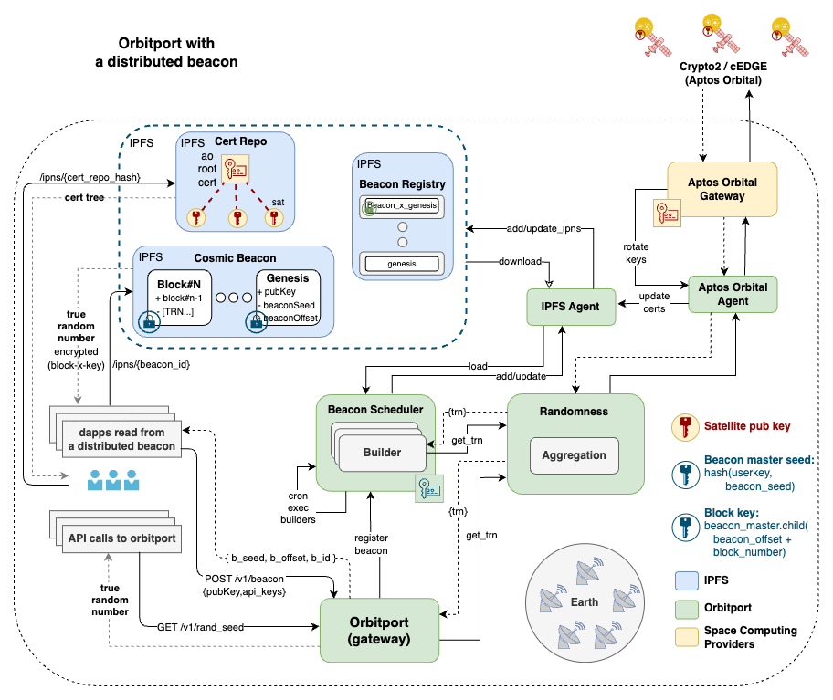

# Orbitport v0.2

## Overview

Orbitport is a gateway to orbital services such as `cTRNG` (cosmic True Random Number Generator) or `spaceTEE`, served by multiple providers & satellites to ensure high availability and reliability.

### Key Goals

- Provide a unified API to access services from multiple sources
- Introduce fallback sources to manage high loads or downtimes
- Enable access from web3 systems/dapps using a beacon of cosmic services output
- Enable verification of the cTRNG signature against the public key of the satellite

### Orbital Services

#### cTRNG

The cosmic True Random Number Generation (cTRNG) is an orbital service that provides true random numbers harvested from hardware on satellites, currently supporting `cEDGE` and `Crypto2` by `Aptos Orbital`. 
The satellite also signs the generated data to ensure it was generated by the satellite and was not tampered with.

#### spaceTEE (coming soon)

The space Trusted Execution Environment (TEE) is an orbital service that provides a secure enclave environment for running code in space, ensuring the integrity and confidentiality of the code and data.

### Features

#### API

Orbitport exposes an HTTP API with token-based authentication, where users are provided with a `client-id` and `client-secret` to issue an access token from a given provider. 

The API is described in the [openapi spec](../swagger.yaml) at the root folder.

#### Web3 Access

Orbitport also enables access from web3 systems/dapps using a **beacon of cosmic services output**.
The beacon contains blocks of random data harvested from space, stored encrypted in a decentralized, distributed storage. Starting with IPFS as the first storage solution, to allow chain agnostic access.

#### Verification

Verification of the cTRNG is done against a signature provided by the satellite to ensure authenticity and integrity of the data. The public keys of all provider are stored in the `Cert Repository` in a DAG structure.

## Architecture

The following diagram visualizes the architecture of the gateway:

### IPFS Integration

IPFS is a decentralized, distributed storage system that provides high availability and global distribution of data.
It works by storing the data in a content-addressed way, where the data is identified by its hash ([CID](https://docs.ipfs.tech/concepts/content-addressing/)) and can be retrieved from any IPFS node.

Orbitport relys on IPFS for storing the certificates, beacon registry and blocks.

IPFS introduces several challenges:

**1. Data availability** 

IPFS is like a cache, where data is stored as long as it's requested but might be cleaned up by the garbage collector if not "pinned".

Pinning can be done by having our own IPFS nodes and use them to add data to the network.

**2. Mutability** 

IPFS uses content addressing, where the data is identified by its hash (CID). This means that the data is immutable and can't be changed once it's added to the network.
To overcome this, we are using [IPNS](https://docs.ipfs.io/concepts/ipns/) to provide a mutability layer on top of IPFS.

**3. Privacy**

IPFS is a public network, where data is shared between nodes. To ensure privacy, we encrypt any sensitive data before storing it on IPFS.

### Satellite Integration

There are 2 main points of integration with the satellites:
- Read cTRNG data via satellite API/SDK.
  - Agents are used abstract the complexity and implementation of the underlying provider.
- Verify authenticity of the cTRNG
  - Verify signature against the public key of the satellite.
  - Verify that the public key is part of the certificate tree of the provider.

Integration with satellites is done through agents, which abstract the complexity and implementation of the underlying providers or their SDKs/APIs.
By having a decoupled agent for each provider, we can easily add new providers and manage the rate limits, auth, etc.

### Deployment

Oribtport is deployed in a Kubernetes cluster, with a load balancer (Traefik) in front to distribute the traffic.

Agents are deployed as lightweight, stateless containers within the same pod as the orbitport service. This approach ensures high availability, simplifies communication through localhost, and maintains reliability while keeping the architecture modular.

IPFS nodes are deployed as a separate service, with a persistent volume to store the data and a service to expose the API to the Orbitport service.

## Core Concepts

### Satellite PKI

Orbitport uses `X.509` certificates to manage public keys for providers and satellites. Each provider holds a root certificate, which is used to sign certificates for its satellites. 
The certificates are stored in the `Cert Repository` as a Directed Acyclic Graph (DAG) on IPFS.

The rational behind the usage of `X.509` certificates is to have a standardized, secure and scalable way to manage public keys for the satellites, with the ability to rotate keys and manage trust relationships.

#### Certificates

- **Root Certificate**:
  - Issued by the provider.
  - Used to sign satellite certificates.
  - Includes `keyCertSign` in the `Key Usage` extension, to allow signing of satellite certificates.
- **Satellite Certificate**:
  - Issued to individual satellites.
  - Includes the satellite's public key.
  - Includes `digitalSignature` in the `Key Usage` extension, to allow (verification of) signing of cTRNG data.

#### Cryptographic Schemes (TBD)

- **Public Key Algorithm**: ECDSA.
- **Key Sizes**:
  - Root cert: 256-bit ECDSA keys.
  - Satellite cert: 256-bit ECDSA keys.

#### Verification Workflow

1. Fetch the provider's root certificate from the Cert Repository.
2. Verify satellite certificate against the provider's root certificate.
3. Extract the satellite pub key from the satellite certificate.
4. Use the public key to validate the signature of the cTRNG data.

#### Key Rotation

Satellite certificates can be rotated by the provider. The process involves issuing a new certificate for the satellite and updating the DAG in the Cert Repository through the `cert controller`.

### Randomness

The gateway supports several sources of randomness.

The desired sources or their priority can be set with a parameter (`src`), the default is to get cTRNG (1) or fallback to derived TRN (2).

1. **ctrng:** Cosmic True Random Number Generation source provided by `cEDGE` or `Crypto2` satellites (by `Aptos Orbital`).
2. **ctrnd:** Cosmic True Random Number Derivation source, where we derive random numbers from a cTRNG seed that we fetch continuously (every 1h by default). The seed is used to generate multiple random numbers by using it as a seed for a bip32 master key and deriving keys from it.

### Beacon

The beacon is made out of blocks, where the first block contains the metadata of the beacon, and the rest of the blocks contain the random data harvested from space upon the configured cron job.

To create a beacon, users provide some public key. Orbitport uses that key and a cTRNG seed to generate a bip32 master key, and derive keys from it to encrypt the blocks of random data.

**Beacon master seed:** `keccak256(beacon_seed, public key)`.
**Block key**: `master_seed.child(beacon_offset + block_number)`.

Both orbitport and the user can derive the same keys for the respective blocks, where orbitport will encrypt blocks and the user decrypt the blocks using simmetric encryption (`AES`).

**NOTE:** encrypted block is random as it holds random bytes, but a decrypted block allows the user to verify the cTRN signature.

#### Beacon Structure

- **Genesis Block**: Contains the metadata of the beacon.
  - (public) Ref: Public key associated with the beacon.
  - (private/encrypted) Data: `[ beacon_seed, beacon_offset ]`
- **Random Data Blocks**: Contain the random data harvested from space.
  - (public) Ref: CID of the previous block.
  - (private/encrypted) Data: `[ cTRN, ... ]`

#### Beacon Regsitry

The beacon regsitry is stored on IPFS and managed by orbitport, it a chain of blocks, where each block contains the metadata (genesis block) of a specific beacon.
The regsitry is loaded by orbitport on startup and updated with each new beacon added.

For encryption, orbitport uses a single master key (`beacon_registry_master`) and derives a key for each provider.

**Beacon Regsitry block key**: `beacon_regsitry_master.child(block_number)`.

#### Beacon Regsitry Key Rotation

The rotation is done with a dedicated migration script, where we read the entire registry, decrypt it with the old key, encrypt it with the new key, and store it back.

- **Failure Handling**:
  - If the migration script fails during key rotation, the process is rolled back to ensure data integrity.
- **Atomic Updates**:
  - The registry is updated atomically to prevent partial updates.
- **Backup**:
  - A backup of the registry is taken before rotation to allow recovery in case of failure.

#### Beacon Scheduler

The beacon scheduler manages the beacons registered in the system.
Upon startup, the scheduler loads the beacons from the registry.
It run an event loop that invokes beacon builder to generate new blocks of random data and add them to the beacon.

- **Failure Handling**: If the beacon builder fails to generate a block (e.g., due to a provider API failure), the scheduler retries the operation with exponential backoff.
- **Prioritization**: The scheduler prioritizes beacons based on their creation time.
- **Concurrency**: The scheduler can process multiple beacons concurrently, with a configurable limit on the number of active tasks.
- **Monitoring**: Logs and metrics are generated for each beacon operation, including block generation time, failures, and retries.

## Glossary

- **cTRNG**: Cosmic True Random Number Generator, a source of randomness harvested from hardware on satellites.
- **spaceTEE**: Space Trusted Execution Environment, a secure enclave for running code in space.
- **Orbitport**: A gateway to orbital services.
- **Aptos Orbital**: A provider of orbital services.
- **cEDGE**: A satellite providing cTRNG services.
- **Crypto2**: A satellite providing cTRNG services.
- **IPFS**: InterPlanetary File System, a decentralized storage system.
- **IPNS**: InterPlanetary Name System, to add mutability layer on top of IPFS.
- **Cert Repository**: A repository of X.509 certificates used to manage public keys for space computing providers and satellites.
- **Beacon**: A structure containing blocks of random data harvested from space.