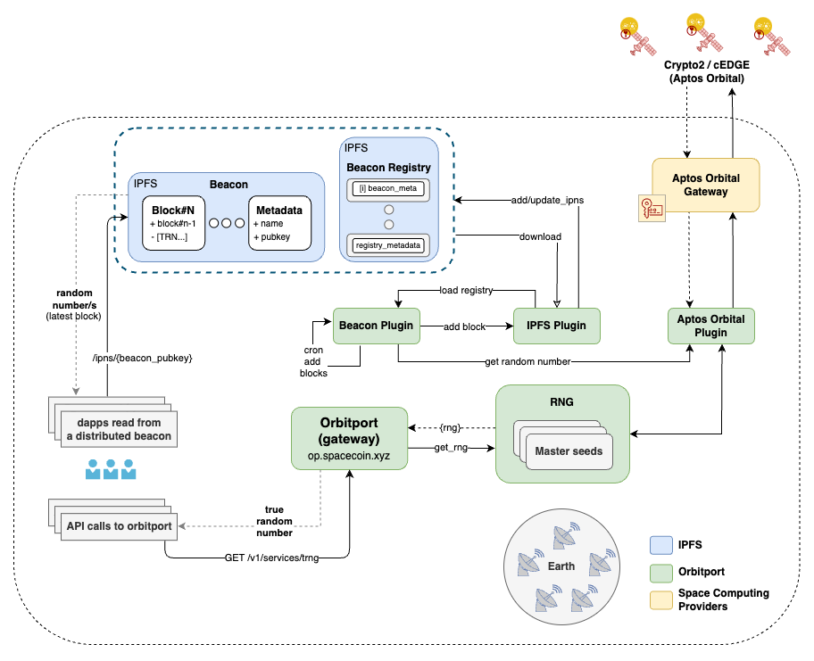

# Orbitport | High-Level Design (v1)

## Overview

Orbitport is a gateway to orbital services such as `cTRNG` (cosmic True Random Number Generator) or `spaceTEE`, served by multiple providers & satellites to ensure high availability and reliability.

### Key Goals

- Provide a unified API to access orbital services of multiple providers and satellites
- Ensure high availability and reliability by serving data from multiple providers/satellites and fallback strategies
- Explore integration with web3 systems and dapps
- Explore verification of the cTRNG signature against the public key of the satellite

### Integrated Services

#### cTRNG

The cosmic True Random Number Generation (cTRNG) is an orbital service that provides true random numbers harvested from hardware on satellites, currently supporting `cEDGE` and `Crypto2` by `Aptos Orbital`.
The satellite also signs the generated data to ensure it was generated by the satellite and was not tampered with.

## Features

#### API

Orbitport exposes a unified HTTP API to access orbital services provided by satellites, allowing users to specify the desired service and source (provider/satellite) to use.

The API is rate limited to ensure fair usage and prevent abuse of the service, and allows to support bulk requests for efficiency.

See the [openapi spec](../swagger.yaml) for implementation details.

#### Authentication

Orbitport uses token-based authentication, where users are provided with a `client-id` and `client-secret` to issue an access token from a given provider. 

#### Web3 Access - Beacon (Experimental)

Orbitport also enables access from web3 systems/dapps using a beacon of cosmic services output.

The **cTRNG Beacon** is stored in a decentralized, distributed storage (starting with IPFS), allowing user to access the data w/o the need for a centralized service/backend.

The beacon will be updated continuously with new batches of cosmic random numbers.

#### Threshold Consumption (Experimental)

Orbitport allows to consume the cTRNG data in a threshold manner, i.e. in a distributed setup where `threshold` peers are providing decryption shares to construct the original random number, achieving a distributed trust model where no single peer can access the full random number without the cooperation of others.

## Architecture

The architecture of Orbitport is designed to be modular, scalable and secure, with minimal runtime dependencies for flexibility and ease of deployment. 

The core components of the system are:
- **Gateway**: The main service that exposes the API and handles requests from users. Written in Rust for performance and safety.
- **Plugins**: Lightweight, stateless grpc services that encapsulate the logic to interact with the underlying providers/satellites and with 3rd party services (e.g. IPFS, authentication), written in golang for easy integration and to work with standard libraries.

The following diagram visualizes the overall architecture of Orbitport:

### Satellite Integration

There are 2 main points of integration with the satellites:
- Read cTRNG data via satellite API/SDK.
  - Plugins are used abstract the complexity and implementation of the underlying provider.
- (planned for v2) Verify the cTRNG was generated by the satellite and was not tampered with.
  
Integration with satellites is done through plugins, which abstract the complexity and implementation of the underlying providers or their SDKs/APIs.
By having a decoupled plugin for each provider, we can easily add new providers and manage the rate limits, auth, etc.

### Deployment

Orbitport can be deployed in a Kubernetes cluster or with some other orchestration system.
It is highly recommended to run a load balancer in front of Orbitport to manage certificate rotation and provide a single entry point to the service.

Plugins are deployed as lightweight, stateless containers within the same pod as the orbitport service. This approach ensures high availability, simplifies communication through localhost, and maintains reliability while keeping the architecture modular.

Plugins implement [gRPC health service](https://grpc.io/docs/guides/health-checking/) for easy monitoring and readiness checks. They run in a "sidecar-like" pattern and can be deployed as separate containers, it is required to share the same network space to ensure secure and fast communication with the gateway.

**NOTE:** IPFS nodes are deployed as a separate service, with a persistent volume to store the data and a service to expose the API to the Orbitport service.

## Concepts

### Randomness

The gateway supports several sources of randomness.

The desired sources or their priority can be set with a parameter (`src`), the default is to get cTRNG (1) or fallback to derived randomness (2).

1. **aptosorbital:** Cosmic True Random Number Generation source provided by `cEDGE` or `Crypto2` satellites (by `Aptos Orbital`).
2. **derived:** Cosmic True Random Number derivation source, where we derive random numbers from a cTRNG seed that we fetch continuously (every 1h by default). The seed is used to generate multiple random numbers by using it as a seed for a bip32 master key and deriving keys from it.

### Beacon (Experimental)

The beacon is made out of blocks, where the first block contains the metadata of the beacon, and the rest of the blocks contain the random data harvested from space upon the configured cron job.

**Beacon Registry**

The beacon registry is stored in the same storage as the beacons, and is managed by orbitport.
The registry contains the metadata of all beacons registered in the system, it will be loaded by orbitport on startup and updated with each new beacon added.

**Beacon Structure**

- **Genesis Block**: Contains the metadata of the beacon.
  - `pubkey`: Public key associated with the beacon.
  - `name`: Name of the beacon.
- **Beacon Block**: Contains a reference to the previous block and a batch of random numbers.
  - `previous`: hash (CID) of the previous block.
  - `seq`: Sequence number (u64) of the block 
  - `rng`: List of random numbers `[ cTRNG, ... ]`

**Beacon Scheduler**

The beacon scheduler runs an event loop that invokes beacon updates of random data.
If the beacon builder fails to generate a block (e.g., due to a provider API failure), the scheduler retries the operation with exponential backoff.

#### IPFS Integration for Beacons

Orbitport relies on IPFS for storing beacons and beacon registry.

IPFS is a decentralized, distributed storage system that provides high availability and global distribution of data.
It works by storing the data in a content-addressed way, where the data is identified by its hash ([CID](https://docs.ipfs.tech/concepts/content-addressing/)) and can be retrieved from any IPFS node.

IPFS introduces several challenges:

**1. Data availability** 

IPFS is like a cache, where data is stored as long as it's requested but might be cleaned up by the garbage collector if not "pinned".

Pinning can be done by having our own IPFS nodes and use them to add data to the network.

**2. Mutability** 

IPFS uses content addressing, where the data is identified by its hash (CID). This means that the data is immutable and can't be changed once it's added to the network.
To overcome this, we are using [IPNS](https://docs.ipfs.io/concepts/ipns/) to provide a mutability layer on top of IPFS.

**3. Privacy**

IPFS is a public network, where data is shared between nodes. To ensure privacy, we encrypt any sensitive data before storing it on IPFS.
