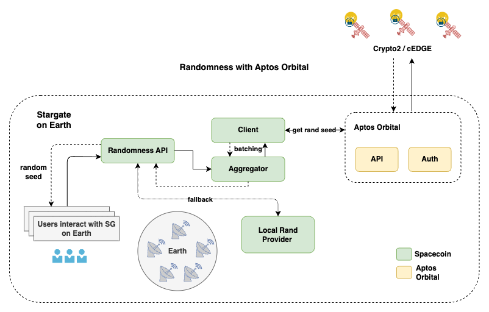

# orbitport docs

This folder contains documentation for `orbitport`.

## Documents

- [API Spec](API.md)
- [Aptos Orbital](APTOS_ORBITAL.md)

## Overview

The Gateway proxies requests to services while providing aggregation and fallback capabilities on top to streamline the integration of space computing services such as randomness generation or TEEs, served by multiple providers to ensure high availability and reliability.

**NOTE:** Altough the gateway is designed to be a simple and modular enough to be easily extended to support new services and providers,
the focus at the moment is on **space randomness** provided by **Aptos Orbital**. 

### Roadmap

- [x] Basic gateway implementation with Aptos Orbital randomness.
- [ ] Aggregation and fallback capabilities.
- [ ] Authentication and rate limiting.
- [ ] Production deployment.
- [ ] Observability and monitoring.

## Architecture

The following diagram visualizes the architecture of the gateway in the context of randomness:

The gateway has several challenges to overcome to provide a reliable and secure service:

### Authentication

TBD

### Aggregation and Throttling

The gateway aggregates requests to the underlying provider, enabling to serve client under limited rate limits and to ensure the entropy of the randomness.

TBD

### Fallback

The gateway provides fallback capabilities to ensure high availability and reliability by switching to another provider in case of failure.

At the moment we are using locally generated randomness as a fallback.

TBD
